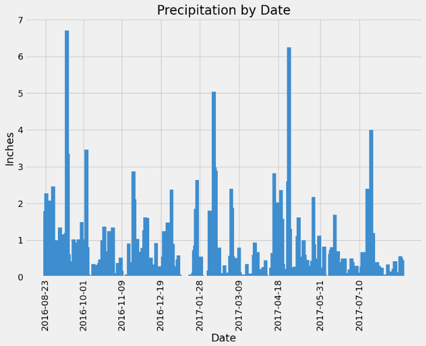
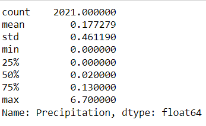
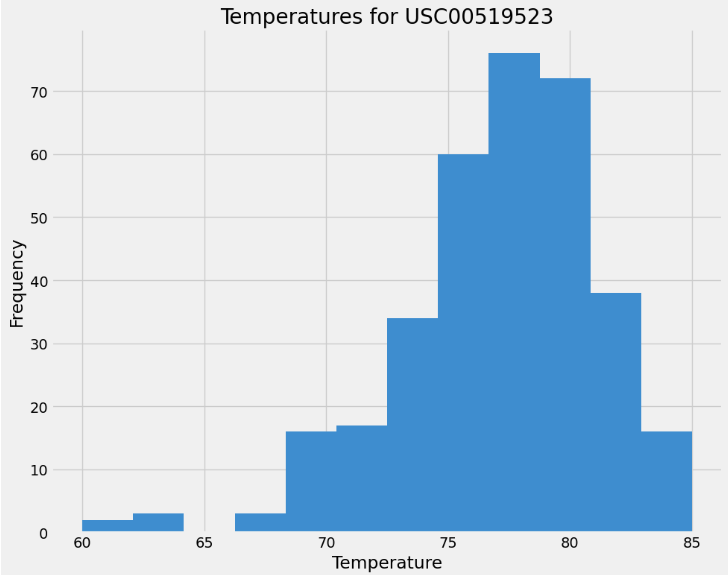

# sqlalchemy-challenge

## Table of Contents

- [Background](#Background)
- [Resources](#Resources)
- [Python Code](#Climate)
- [APP](#APP)

# Background
Congratulations! You've decided to treat yourself to a long holiday vacation in Honolulu, Hawaii. To help with your trip planning, you decide to do a climate analysis about the area. The following sections outline the steps that you need to take to accomplish this task.

# Resources
A single file was utilized for this project, hawaii.sqlite, which has two tables 'measurement', and 'station'.  station table holds the station primary key, along with name, latitude, longitude, and elevation of the station.  While measurement table holds the station foreign key, date of readings, precipitation (as prcp), and a temperature reading (as tobs which stands for Time of Observation Error).

The .CSVs were provided to give context to what was inside the sqlite local server.

# Climate
Exploratory Precipitation Analysis:
By starting with the end date of 2017-08-23 and going back one year 2016-08-23.

Summary Statistics of the data that was used to plot

Exploratory Station Analysis:
Looking at the over all tob data for all nine stations.  The most active station  USC00519281 was choosen to look at the minimum, maximum, and average tob from 2017-08-23 - 2016-08-23.

# APP API SQLite:
I made an app that accesses the Hawaii.sqlite SQL database.

/api/v1.0/precipitation:
Returns a JSONify format of the last 12 months of data for precipitation data points.

/api/v1.0/stations:
Returns a JSONify format of the 9 stations.

/api/v1.0/tobs:
Returns a JSONify tobs between 2016-08-23 through 2017-08-23 for the most active station USC00519523.

/api/v1.0/<start_date> :
Returns a JSONify list that has the Minimum, Maximum, and Average tobs from the date entered to the final date in the sqllite local server (2017-08-23).

/api/v1.0/<start_date>/<end_date>:
Returns a JSONify list that has the Minimum, Maximum, and Average tobs from the start_date entered to the end_date in the sqllite local server.
